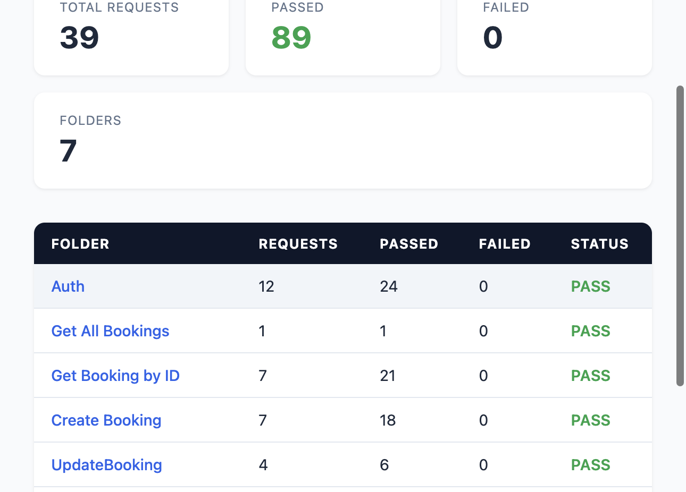
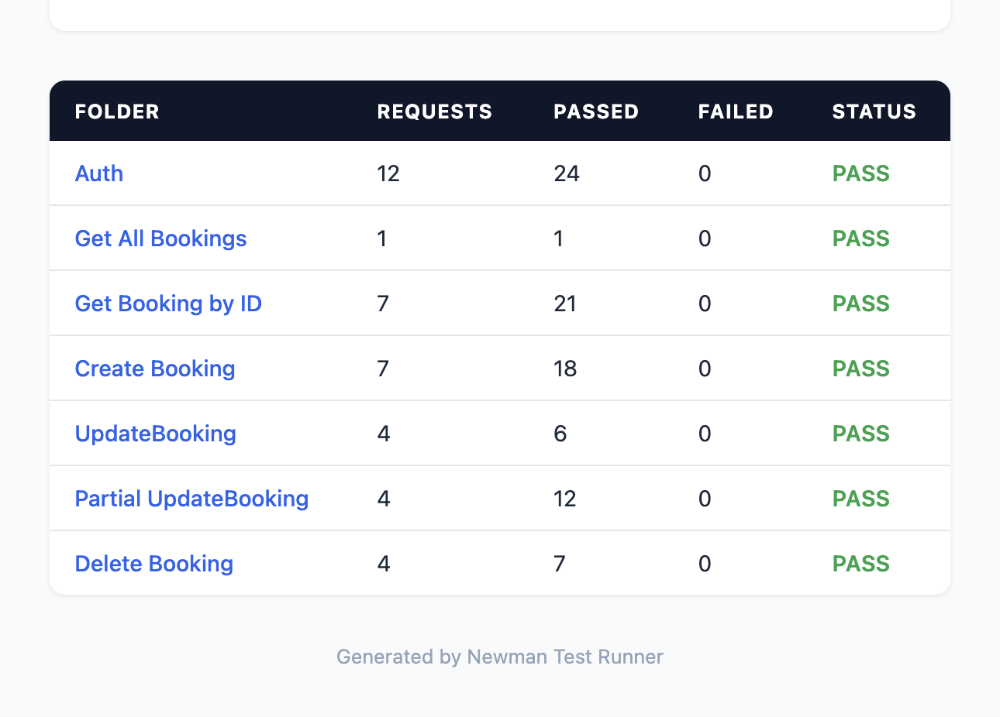

# Restful Booker API Testing

Automated API test suite for the [Restful Booker](https://restful-booker.herokuapp.com/apidoc/index.html) public API, built with **Postman** and executed via **Newman**. The project uses **CSV-driven data files** for each endpoint to run positive, negative, and edge-case scenarios in a single automated run. A **GitHub Actions** pipeline runs the full suite daily and publishes HTML reports to GitHub Pages.



---

## Tech Stack

| Tool | Purpose |
|---|---|
| **Postman** | Collection design, test scripting, environment management |
| **Newman** | CLI runner (programmatic Node.js API) |
| **newman-reporter-htmlextra** | Rich HTML reports per folder |
| **GitHub Actions** | CI/CD — daily scheduled runs, report publishing |
| **GitHub Pages** | Auto-published test report dashboard |

---

## API Endpoints Covered

The Restful Booker API is a CRUD booking system. Every endpoint is tested with its own CSV data file:

| # | Endpoint | Method | CSV Data File | Iterations |
|---|---|---|---|---|
| 1 | `/ping` | GET | — | Health check |
| 2 | `/auth` | POST | `testData-login.csv` | 6 |
| 3 | `/booking` | GET | — | 1 |
| 4 | `/booking/:id` | GET | `testData-bookingID.csv` | 7 |
| 5 | `/booking` | POST | `testData-createBooking.csv` | 7 |
| 6 | `/booking/:id` | PUT | `testData-updateBooking.csv` | 4 |
| 7 | `/booking/:id` | PATCH | `testData-Partial-UpdateBooking.csv` | 4 |
| 8 | `/booking/:id` | DELETE | `testData-delete-booking.csv` | 3 |

---

## Test Scenarios & Coverage

### Auth — `POST /auth` (6 scenarios)

| Scenario | Username | Password | Expected |
|---|---|---|---|
| Valid credentials | `admin` | `password123` | Token returned |
| Wrong password | `admin` | `wrongpass` | `Bad credentials` |
| Non-existent user | `nosuchuser` | `password123` | `Bad credentials` |
| Empty username | *(empty)* | `password123` | `Bad credentials` |
| Empty password | `admin` | *(empty)* | `Bad credentials` |
| Both empty | *(empty)* | *(empty)* | `Bad credentials` |

**Assertions:** Status code, Content-Type header, token presence (positive), error message (negative), response time < 5s

### Get Booking by ID — `GET /booking/:id` (7 scenarios)

| Scenario | Booking ID | Expected Status |
|---|---|---|
| Valid existing ID | `1` | 200 |
| Valid existing ID (Case 2) | `3` | 200 |
| Non-existent high ID | `9999999` | 404 |
| Invalid string ID | `abc` | 404 |
| Zero ID | `0` | 404 |
| Negative ID | `-5` | 404 |
| Special characters | `!@#$` | 404 |

**Assertions:** Status code, JSON schema validation (tv4), error message for 404s

### Create Booking — `POST /booking` (7 scenarios)

| Scenario | Expected Status |
|---|---|
| Empty FirstName (Allowed) | 200 |
| Negative Price (Allowed) | 200 |
| Missing `firstname` key | 500 |
| Invalid Type: Price as String | 500 |
| Empty JSON Body `{}` | 500 |
| Special Characters in Name | 200 |
| Positive: Valid Booking | 200 |

**Assertions:** Status code, JSON schema validation, booking ID persistence, error message for 500s. Pre-request script dynamically builds the request body and handles structural negative tests (key deletion).

### Update Booking — `PUT /booking/:id` (4 scenarios)

| Scenario | Expected Status |
|---|---|
| Positive: Full Update | 200 |
| Positive: Full Update 2 | 200 |
| Negative: Missing Name | 400 |
| Negative: Empty Body | 400 |

**Assertions:** Status code, JSON schema validation for successful updates

### Partial Update Booking — `PATCH /booking/:id` (4 scenarios)

| Scenario | Expected Status |
|---|---|
| Positive: Patch Price/Deposit | 200 |
| Negative: Negative Price | 200 |
| Negative: Invalid Boolean Type | 200 |
| Negative: Empty JSON Body `{}` | 200 |

**Assertions:** Status code, JSON schema validation, patched value verification against CSV data

### Delete Booking — `DELETE /booking/:id` (3 scenarios)

| Scenario | Expected Status |
|---|---|
| Delete valid booking | 201 |
| Delete non-existent ID | 405 |
| Delete invalid ID format | 405 |

**Assertions:** Status code, response body check, **double verification** — sends a follow-up GET request to confirm the deleted booking returns 404

---

## Test Report

Reports are auto-generated as HTML dashboards with per-folder drill-down:



| Folder | Requests | Assertions | Status |
|---|---|---|---|
| Auth | 12 | 24 | PASS |
| Get All Bookings | 1 | 1 | PASS |
| Get Booking by ID | 7 | 21 | PASS |
| Create Booking | 7 | 18 | PASS |
| UpdateBooking | 4 | 6 | PASS |
| Partial UpdateBooking | 4 | 12 | PASS |
| Delete Booking | 4 | 7 | PASS |
| **Total** | **39** | **89** | **ALL PASS** |

---

## Project Structure

```
├── .github/workflows/
│   └── api-tests.yml                 # CI/CD pipeline (daily schedule + push)
├── assets/                           # Screenshots for README
├── Restful-Booker-API-testing.postman_collection.json
├── Restful-Booker-env.postman_environment.json
├── run-tests.js                      # Newman programmatic runner
├── package.json
├── testData-login.csv
├── testData-bookingID.csv
├── testData-createBooking.csv
├── testData-updateBooking.csv
├── testData-Partial-UpdateBooking.csv
├── testData-delete-booking.csv
└── newman-reports/                   # Generated HTML reports (gitignored)
```

---

## How to Run

### Prerequisites

- Node.js 18+

### Local Execution

```bash
# Install dependencies
npm install

# Run the full test suite
npm test
```

The runner executes all 7 folders sequentially with their CSV data files, bridges authentication tokens and booking IDs between runs, and generates timestamped HTML reports in `newman-reports/`.

### CI/CD (GitHub Actions)

The pipeline runs automatically on:
- **Daily schedule** — 8:00 AM UTC every day
- **Push** to `main` / `master`
- **Pull requests**
- **Manual trigger** via GitHub Actions UI

Reports are:
1. Uploaded as **downloadable artifacts** (retained 30 days)
2. Published to **GitHub Pages** for instant browsing

---

## How the Newman Runner Works

Newman only accepts one CSV data file per run. Since each folder needs its own CSV, the runner (`run-tests.js`) uses Newman's programmatic API to execute folders sequentially:

1. **Auth** runs first — the runner extracts the auth token from the HTTP response
2. **Create Booking** runs — the runner extracts `bookingid` from the response
3. Between each run, the exported environment file is **patched** with the extracted `token` and `last_booking_id` so subsequent folders (Update, Patch, Delete) can authenticate and target the correct booking

This was necessary because Newman's `exportCollection` does not persist variables set at runtime via `pm.collectionVariables.set()`, and negative test iterations that call `pm.environment.unset()` clear the token from the exported environment.

---

## Known Limitations & Drawbacks

### Public API Constraints

- **No control over request/response validation** — The Restful Booker API is a public demo API that does not strictly validate input data. For example, it accepts empty strings for `firstname`, negative numbers for `totalprice`, and special characters in name fields without returning proper validation errors (400). This means many negative test scenarios that *should* fail with 400 Bad Request instead return 200 OK. The test expectations had to be written around the API's actual behavior, not the ideal behavior.

- **No proper HTTP status codes for errors** — The API returns `200 OK` for authentication failures (instead of `401 Unauthorized`), `500 Internal Server Error` for missing required fields (instead of `400 Bad Request`), and `201 Created` as the body text for a successful `DELETE` operation. This limits the ability to write meaningful status code assertions.

- **Shared public state** — Since this is a shared public API, booking IDs created by other users can appear, disappear, or be modified at any time. Test data like `bookingId=1` in the CSV may intermittently return 404 if another user deletes it. The test suite works around this by creating its own bookings and chaining the IDs.

- **No rate limiting transparency** — The Heroku-hosted API has occasional cold starts (response times spiking to 5+ seconds) and unpredictable latency, which can cause flaky performance assertions.

### Test Design Limitations

- **Cannot test proper field validation** — Scenarios like "max length exceeded", "SQL injection in input", "XSS payload in fields" cannot be meaningfully tested because the API accepts virtually any string input without sanitization or rejection.

- **Cannot test proper authentication flows** — The API returns 200 for all auth attempts (valid or invalid) with different JSON bodies, so there's no way to test actual 401/403 status code behavior for invalid credentials.

- **Cannot verify data integrity** — The API does not validate that `checkout` date is after `checkin` date, does not enforce required fields consistently, and silently accepts malformed data. This prevents writing comprehensive boundary and constraint tests.

- **Delete endpoint returns inconsistent status** — A successful delete returns `201 Created` (instead of `200 OK` or `204 No Content`), so the delete verification relies on a follow-up GET returning 404 rather than trusting the response code.

---

## What I Learned

- Designing **data-driven test suites** with CSV files for positive, negative, and boundary testing
- Using **pre-request scripts** to dynamically construct request bodies and handle structural negative tests (field deletion, empty payloads)
- **JSON schema validation** using tv4 in Postman test scripts
- Building a **Newman programmatic runner** that bridges state (auth tokens, booking IDs) between independent folder runs
- Setting up **GitHub Actions CI/CD** with scheduled runs, artifact uploads, and GitHub Pages deployment
- Writing tests around a **public API with inconsistent validation** — adapting expectations to actual behavior while documenting ideal behavior
